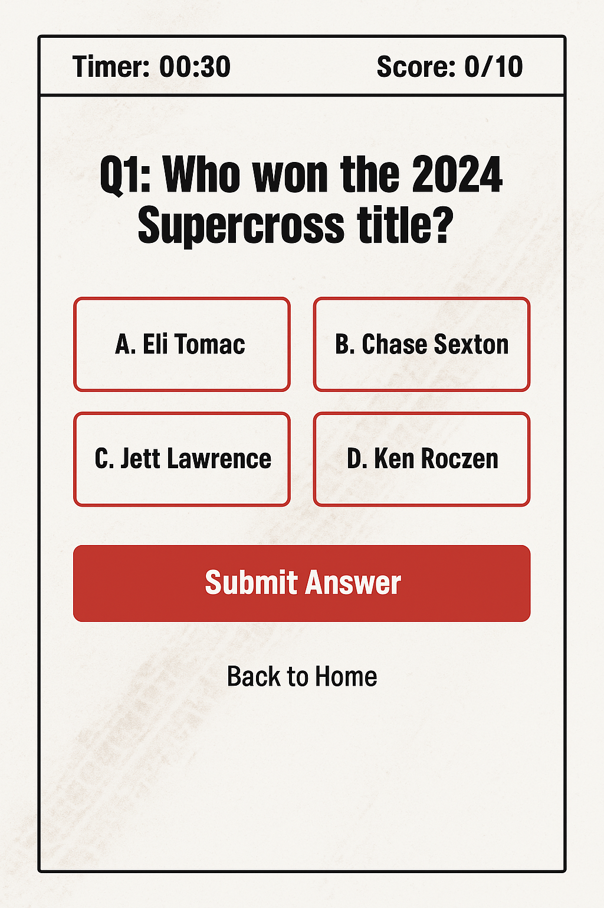

# Supercross Trivia Challenge

## Overview

Welcome to the Supercross Trivia Challenge, a web-based trivia game designed for fans of Supercross, Motocross, and the SuperMotocross World Championship (SMX). This project is being developed as part of my 408 Web Development class, leveraging an AWS backend and a flexible front-end framework of my choosing. The application aims to engage motorsport enthusiasts with dynamic, timed trivia questions centered around the high-octane world of dirt bike racing, while showcasing my skills in cloud architecture, database management, and interactive UI design.

### General Theme

The general theme of the Supercross Trivia Challenge is a motorsport-inspired trivia game with a specific focus on Supercross, Motocross, and SMX. Fans can test their knowledge of riders, tracks, historic moments, and technical details of the sport. The app draws inspiration from the fast-paced, competitive nature of dirt bike racing, offering a fun and educational experience wrapped in a gritty, rugged aesthetic.

### What It’s Going to Do

The Supercross Trivia Challenge will allow users to:
- Play timed trivia rounds with randomly selected questions from a pool of Supercross, Motocross, and SMX topics (e.g., "Who won the 2023 SMX Championship?" or "What’s the longest jump ever recorded in Supercross?").
- View their scores and compare them on a leaderboard.
- Submit their own trivia questions, contributing to the question pool after approval.
- Explore a simple stats page showing their performance history (e.g., total games played, average score).

The app will feature a responsive interface with motorsport-inspired visuals (tire tread patterns, bold reds and blacks). On the backend, AWS services will handle question retrieval, score tracking, and user submissions, ensuring a scalable and reliable experience.

### Target Audience

The target audience is primarily Supercross, Motocross, and SMX fans, ranging from casual viewers to hardcore enthusiasts.

### Data Management

The Supercross Trivia Challenge will manage the following dynamic data:
- **Trivia Questions**: Stored in AWS DynamoDB, including question text, answer options, correct answer, and category (Riders, Tracks, History). Users can submit new questions via a form, which are reviewed before being added.
- **User Scores**: Saved in DynamoDB, tied to a unique session or user ID (if authentication is implemented), including score, date, and time taken per game.
- **Leaderboard Entries**: Aggregated from user scores, stored in DynamoDB, and updated dynamically to display top players.
- **User Submissions**: Temporarily stored in DynamoDB with a status (pending/approved/rejected), processed via AWS Lambda, and emailed to an admin using AWS SES.

Static things like logos or background images won’t be part of this dynamic data but will enhance the UI. The focus is on user interaction and content generation, showcasing the ability to handle CRUD operations in a cloud environment.

### Stretch Goals

Once the core functionality is complete, I’d like to add these features for extra polish:
- **User Accounts**: Integrate AWS Cognito for login, allowing users to save their progress, track personal stats, and earn badges (e.g., "Rookie Champion" for 10 wins).
- **Question Difficulty Levels**: Add easy, medium, and hard tiers, with higher points for tougher questions.
- **Multimedia Questions**: Incorporate images or short video clips (stored in AWS S3) into questions, like identifying a rider from a race photo.
- **Social Sharing**: Let users share their scores on social media with a custom graphic (e.g., "I scored 95% on Supercross Trivia!").
- **Live Trivia Events**: Host real-time trivia contests using AWS WebSocket API Gateway, where players compete simultaneously.

## Technical Stack

- **Backend**: AWS (Lambda for logic, DynamoDB for data, SES for email notifications, S3 for potential media storage).
- **Frontend**: [TBD—likely React or Vue.js] with CSS for styling and JavaScript for game logic.
- **Purpose**: This project will demonstrate my skills in full-stack development, cloud services, and user-focused design.

